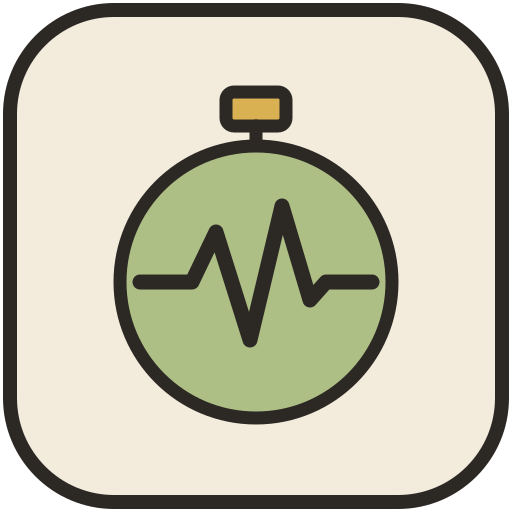
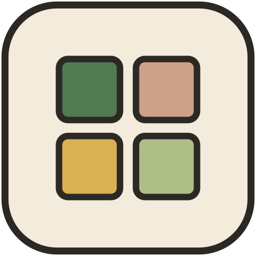
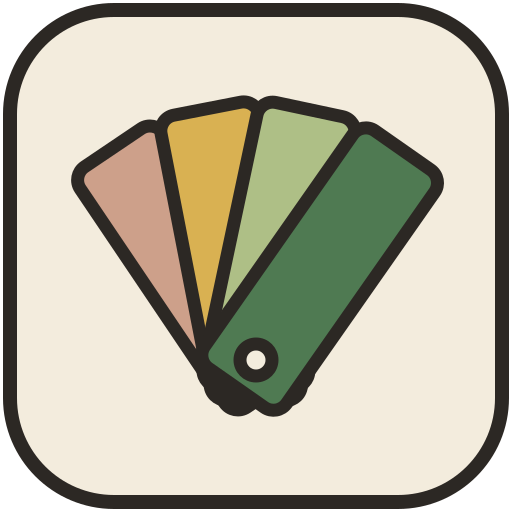

# Elijah Frost

I am a first-year student at Johns Hopkins University and intend to major in neuroscience. In high school I spent two summers as a research intern at Oregon Health & Science University, first in the Galbraith Lab, which studies cell migration and adhesion with single-molecule imaging, and then in the Gibbs Lab, which develops fluorescent contrast agents for cancer imaging and image-guided surgery.

Most of the projects below are tools I built for work I was already doing, such as planning a summer camp week, studying from flashcards, and running my own website.

<table>
  <tr>
    <td width="64"></td>
    <td><a href="https://github.com/elijahnfrost/camp-library"><b>Camp Library</b></a> Activity library and week calendar for running a summer day camp, with run lists you can present from a phone. Next.js, TypeScript, and Postgres.</td>
  </tr>
  <tr>
    <td width="64"></td>
    <td><a href="https://github.com/elijahnfrost/anki-to-slides"><b>Anki to Slides</b></a> Converts Anki decks and Notion toggle pages into PDF, PowerPoint, or PNG slide decks, and back into Anki decks. Python on Vercel.</td>
  </tr>
  <tr>
    <td width="64"></td>
    <td><a href="https://github.com/elijahnfrost/pulse-timer"><b>Pulse Timer</b></a> Interval timer with randomized interval lengths, plus a standard timer and a stopwatch. Next.js and TypeScript.</td>
  </tr>
  <tr>
    <td width="64"></td>
    <td><a href="https://github.com/elijahnfrost/project-directory"><b>Project Directory</b></a> Lists every live project under elijahfrost.com by reading the domain's Cloudflare DNS records. JavaScript on Vercel.</td>
  </tr>
  <tr>
    <td width="64"></td>
    <td><a href="https://github.com/elijahnfrost/design-system"><b>Design System</b></a> Color, type, and motion tokens with optional React components, shared across my web projects.</td>
  </tr>
</table>

[Website](https://elijahnfrost.com) · [ORCID](https://orcid.org/0009-0005-6979-8633) · [contact@elijahfrost.com](mailto:contact@elijahfrost.com)
